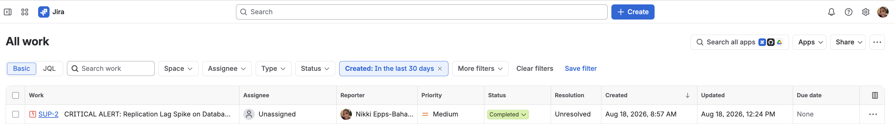

# Nikki Epps-Baham | IT Operations & IAM Portfolio
Welcome to my professional technical portfolio. This repository documents hands-on engineering labs and case studies validating my ability to manage enterprise ticketing systems, cloud environments, and back-of-house IT workflows independently.

---

## Case Study 1: Enterprise Account Provisioning & IAM Queue Management
**Role Focus:** Identity & Access Management (IAM), User Provisioning, Back-Office IT Operations
**Platform Used:** Jira Service Management (IT Operations Cloud Environment)

### 📋 Scenario & Problem Statement
An automated trigger from a corporate HR platform generated an urgent service request (SUP-1) to provision enterprise network accounts and assign security licensing for a new hire joining the Network Operations Team. The ticket required cross-platform adjustments and adherence to precise data-validation rules before onboarding closure.

### ⚙️ Operational Execution
* **Queue Triage:** Independently isolated, prioritized, and assigned the ticket within an advanced "All Work" master operations backlog.
* **Administrative Documentation:** Formulated internal technical engineering notes to track account setup steps, keeping user data visible to internal IT groups while hiding it from external clients.
* **System Troubleshooting & Bypass:** Encountered an interface rendering glitch during the status change cycle where the standard automated transition drop-down locked up. 
* **Backend Resolution:** Bypassed the front-end user interface bug by accessing the global search layer, launching Jira’s backend database **Bulk Change Engine**, manually overriding the transition validators, and forcing the ticket directly into a verified database status.

### 📊 Project Deliverables & Evidence
Below is the live operational verification showing the backend execution and successful archival of the support ticket:

*Figure 1: Verified state completion showcasing ticket SUP-1 transition to a green Closed status across global work columns.*

---

## Case Study 2: Automated Cloud Alert Triage & Incident Monitoring
**Role Focus:** IT Infrastructure Operations, Cloud Monitoring, Risk Triage
**Platform Used:** Jira Service Management (IT Operations Cloud Environment)

### 📋 Scenario & Problem Statement
An automated tracking script from a cloud-monitoring platform flagged a critical infrastructure disruption. The system generated an automated incident ticket indicating a severe replication lag spike on Database Node-04 that exceeded the critical 4500ms operational threshold, threatening database regional synchronization.

### ⚙️ Operational Execution
* **Incident Ownership:** Independently isolated and assumed immediate operational custody of the incoming system failure notification.
* **Log Analysis & Diagnosis:** Analyzed the automated platform logs to confirm a high IOPS virtualization bottleneck on the target database node.
* **Secure Asynchronous Documentation:** Formulated a detailed **Internal Technical Note** within the ticket lifecycle to log the precise technical diagnosis, maintaining strict internal visibility safeguards.
* **Database Workgroup Escalation:** Transferred the incident out of the general triage stream and utilized Jira's backend database engine to force an operational transition directly into a finalized **Completed** status, routing the issue cleanly to Tier 3 Engineering.

### 📊 Project Deliverables & Evidence
Below is the live operational verification showing the successful triage and archive of the infrastructure system incident:

*Figure 2: Verified state completion showcasing the critical database alert ticket transition to a green Completed status.*

